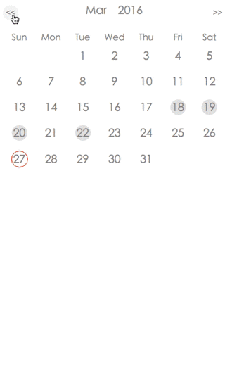

# web-calendar-plugin
A web calendar plugin which can read links and automatically add links to the special date in the calendar. It is similar to the most calendar plugin in the blog. I developed it for my own blog.
## Features



* Develop with raw JavaScript and CSS3.
* Design by responsive idea, fit in different size of screen.
* The date is between 2000-01-01 and 2100-12-31.

## Todo
- [ ] Optimization on translation, use more CSS3.
- [ ] Debug on different browser.
- [ ] Add more theme.

## How to use
1. There are two files in the src folder. Separately move the calendar.css and calendar.js files to your special resource. 
2. Link the css file to your web page in the head scope.
3. Add the following codes to your web page where you want to place the calendar. 

   ```html
   <div class="wrapper" id="calendar-wrapper">
           <!-- add your links here -->
           <!-- for example -->
           <a class="post-link" href="url">2016-03-22</a>
   </div>
   <!-- you must change your own js file path here -->
   <script src="./src/calendar.js"></script>
   ```
   Remember that the date formula should be like "yyyy-mm-dd".
4. You can change the calendar size and font size by the calendar wrapper. Just add your own setting in your css file.

